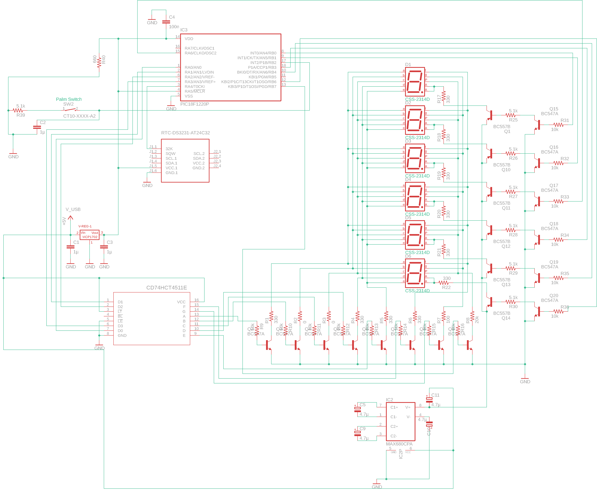

# Stopwatch with PIC18f1220 Microcontroller

This repository contains a stopwatch project based on the PIC18f1220 micro controller for for example local community sports or fun events.

## Exemplary Parts List

* PIC18F1220P
    - Microcontroller
* RTC-DS3231-AT24C32
    - Arduino Real Time Clock Module
* CD74HCT4511E
    - BCD-to-7 Segment Latch/Decoder/Driver
* Button/Palm Switch
* MCP1702
    - Low Quiescent Current LDO Regulator to drive the PIC with 3.3V
* 6x 7-Segment displays
* MAX680CPA
    - +5V to ±10V Voltage Converter to drive the 7-Segment displays
* 6x BC557B and 14x BC547A transistors to switch the 7-Segment displays with the higher voltage
* Capacitors and resistors (see the image of the circuit)

## Basic Functioning

The basic functioning of the stopwatch is, the real time clock giving a 32kHz-Signal from which the microcontroller can count the seconds. The milliseconds are counted from the microcontroller clock and synchronized every second with the 32kHz-Signal. The 32kHz-Signal is much more precise. This means there are three interrupts programmed for the microcontroller one for the button press, one for the seconds counter overflow and one for the milliseconds counter overflow. For detailed information read the code and try to understand it using the PICs manual.

## Circuit

